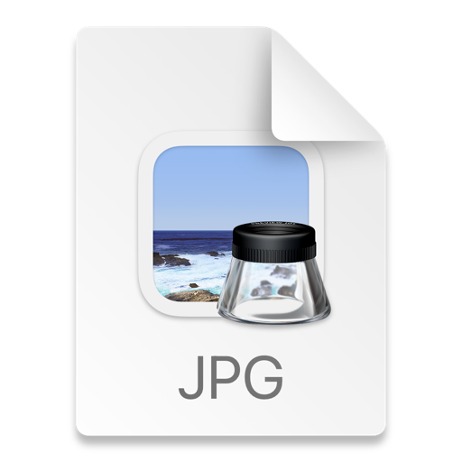

# Docker

<b>
ارسال درخواست به وب سرور:
</b>

در این بخش، با کمک برنامه‌ی postman اقدام به ارسال درخواست به برنامه کردیم تا هم کاربر جدید بسازیم، هم بعد از آن برای این کاربر ساخته شده یادداشت بسازیم. البته در این میان نیاز به لاگین کردن هم بود که خود postman در ادامه‌ی آن کوکی را ست کرد که باعث شد کاربر لاگین بماند. مراحل خواسته شده در صورت سوال به صورت زیر است:

****

<b>
تعامل با داکر:
</b>

****

<b>
پرسش‌ها:
</b>

وظایف زیر را توضیح دهید:

۱. image

داکر ایمیج 
فایلی است که برای اجرای کد در کانتینر داکر استفاده می شود.
docker image
ها
به عنوان مجموعه‌ای از دستورالعمل‌ها برای ساخت یک کانتینر داکر، مانند یک الگو، عمل می‌کنند.
 docker image
ها
همچنین به عنوان نقطه شروع هنگام استفاده از Docker عمل می کنند.
یک 
image
با یک
snapshot
در محیط های ماشین مجازی قابل مقایسه است.

یک
docker image 
یک الگوی readOnly است که حاوی مجموعه‌ای از دستورالعمل‌ها برای ایجاد کانتینری است که می‌تواند روی پلتفرم داکر اجرا شود. این یک راه راحت برای بسته بندی برنامه ها و محیط های سرور از پیش پیکربندی شده ارائه می دهد که می توانید از آنها برای استفاده خصوصی خود استفاده کنید یا به صورت عمومی با سایر کاربران Docker به اشتراک بگذارید.

۲. dockerfile

فایل Dockerfile یک فایل متنی است که شامل تمام دستوراتی است که کاربر می تواند در
command line
برای جمع آوری یک
image 
فراخوانی کند.
Dockerfile از DSL (Domain Specific Language) استفاده می کند و حاوی دستورالعمل هایی برای تولید یک Docker image است. Dockerfile فرآیندهایی را برای تولید سریع یک image تعریف می کند.

۳. container

کانتینر یک واحد استاندارد نرم افزار است که کد و تمام وابستگی های آن را بسته بندی می کند تا برنامه به سرعت و با اطمینان از یک محیط محاسباتی به محیط دیگر اجرا شود. یک docker container image یک package نرم افزاری سبک وزن، مستقل و قابل اجرا است که شامل همه چیزهایی است که برای اجرای یک برنامه لازم است: کد، زمان اجرا، ابزارهای سیستم، کتابخانه های سیستم و تنظیمات.

کاربرد kubernetes:

کوبرنتیز یک روش کارآمد برای اجرای سیستم های multi-tenant است. چه بخواهید چندین برنامه و محیط را مستقر کنید، یا نیاز به جداسازی منابع توسط تیم داشته باشید، ویژگی‌های Kubernetes مانند فضاهای نام و کنترل دسترسی مبتنی بر نقش (RBAC) می‌توانند برای تقسیم خوشه‌ها به برش‌های منطقی برای هر یک از مستاجران شما استفاده شوند.

رابطه‌ی kubernetes با داکر:

داکر برای بسته بندی برنامه ها در کانتینرها استفاده می شود، در حالی که Kubernetes برای هماهنگی و مدیریت آن کانتینرها در تولید استفاده می شود.

